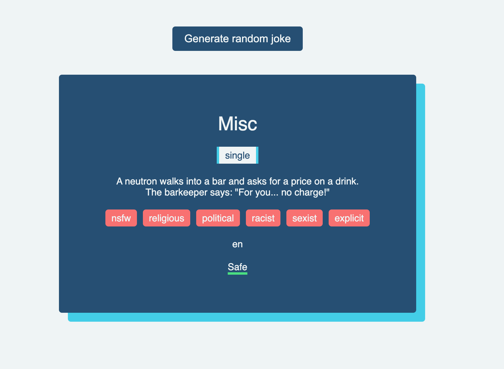

# Image gallery

> This is a mini app that generates random jokes from an api.



## Table of contents

- [General info](#general-info)
- [Technologies](#technologies)
- [Setup](#setup)
- [Features](#features)
- [Status](#status)

## General info

> The objective of the project is to fetch random jokes from an api and display them on the DOM.

## Technologies

- JavaScript, HTML, CSS3

## Setup

- clone the repo 
- Initialize the project with `git install`
- Visit the index.html file 


## Code Examples

```js
const getJoke = async () => {
    try {
        const res = await fetch('https://v2.jokeapi.dev/joke/Any');

        if(res.ok){
            const data = await res.json();
            return data;
        } else {
            throw new Error ('Failed to fetch joke.')
        }
    } catch (error) {
        console.lot(error);
    }
}

export default getJoke;
```

## Features

List of features ready and Todos for future development

- Display of joke categories

To-do list:

- Favorite the best jokes

## Status

Project is: _completed_
